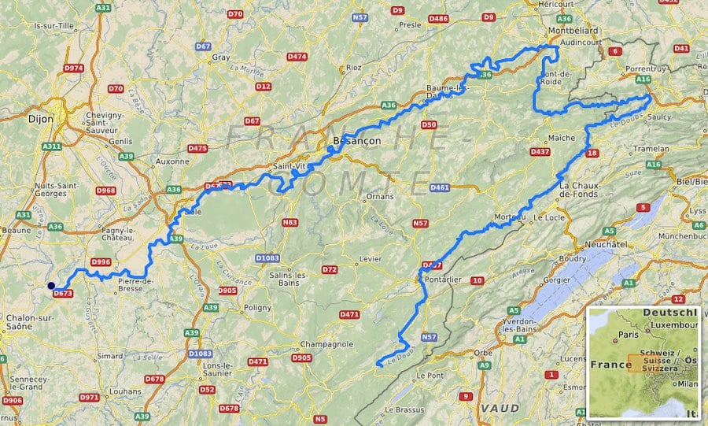

# Documentation à utiliser pour ce travail

Afin d'analyser vos données en tenant compte de leur contexte, vous utiliserez les documents repris dans les PDF suivants :

-   `recueil_hydro_typologies_2018.pdf``

-   `Verneaux_2003_doubs_river.pdf`

dont les citations sont déjà intégrées dans le fichier `references.bib` que vous utiliserez pour citer vos sources dans vos documents Quarto. Lisez attentivement ce qui suit ainsi que ces documents PDF avant de commencer vos analyses.

## Communautés piscicoles de la rivière Doubs

Le [Doubs](http://www.cosmovisions.com/Doubs.htm){target='_blank'} (prononcez "dou") est une rivière qui serpente entre la France et la Suisse pour se jeter finalement dans la Saône près de Chalon-sur-Saône (point noir sur la carte ci-dessous) après avoir parcouru près de 450\ km.

La distribution des poissons est étudiée dans cette rivière (Verneaux 1973, 2003). Pour ce faire, 30 stations sont échantillonnées. Elles sont numérotées dans l'ordre de 1 à 30 le long de son cours jusqu'à ce que la rivière se déverse dans la Saône (après la station 30).

À chaque station, les hommes de terrain ont effectué une collecte des poissons présents et les ont dénombrés. Au total, ils ont pu observer 27 espèces différentes.

Vous vous doutez bien que plusieurs habitats différents peuvent exister dans cette longue rivière, menant à des communautés végétales et animales différentes également. Par ailleurs, une variation progressive d'une station à l'autre est également parfaitement possible ici. Votre travail va consister en une exploration multivariée du jeu de données pour proposer une segmentation en zones caractérisés par des conditions physico-chimiques et/ou des compositions en faune piscicole différentes.

Vous avez à disposition l'article de 2003 de Verneaux, ainsi qu'un court article sur la typologie des cours d'eaux (Anonyme, 2018) et une vidéo sur le Doubs <https://www.ina.fr/video/CAF93027933> pour cerner le sujet. Ces références sont anciennes, mais contemporaines au jeu de données que vous allez analyser.

## Références {-}

Agence française pour la biodiversité. 2018. "Les typologies des cours d'eau". Onema et Office Français de la Biodiversité. <https://professionnels.ofb.fr/sites/default/files/pdf/RecueilHydro_15-typologies_2018v6.pdf>.

Verneaux, J. 1973. "Cours d'eau de Franche-Comté (Massif du Jura): recherches écologiques sur le réseau hydrographique du Doubs: essai de biotypologie". Thèse de doctorat,Institut des Sciences Naturelles, Besançon.

Verneaux, J, A Schmitt, V Verneaux, et C Prouteau. 2003. "Benthic insects and fish of the Doubs River system: typological traits and the development of a species continuum in a theoretically extrapolated watercourse". *Hydrobiologia* 490: 63-74.
