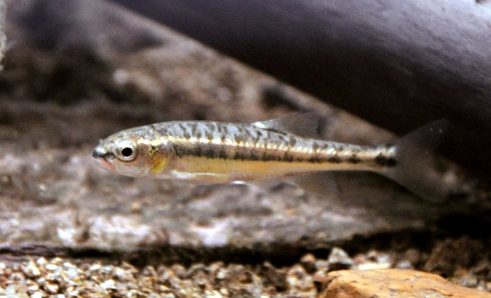

# Communautés piscicoles de rivière

Le [Doubs](http://www.cosmovisions.com/Doubs.htm){target='_blank'} (prononcez "dou") est une rivière qui serpente entre la France et la Suisse pour se jeter finalement dans la Saône près de Chalon-sur-Saône (point noir sur la carte ci-dessous) après avoir parcouru près de 450\ km.

La distribution des poissons est étudiée dans cette rivière (Verneaux 1973). Pour ce faire, 30 stations sont échantillonnées tout au long de son cours. Le schéma suivant montre la disposition relative des stations les unes par rapport aux autres depuis la source (station1) jusqu'à ce que la rivière se déverse dans la Saône (après la station 30).

À chaque station, les hommes de terrain ont effectué une collecte des poissons présents et les ont dénombrés. Au total, ils ont observé 27 espèces reprises dans la table suivante.

Vous vous doutez bien que plusieurs micro-habitats différents peuvent exister tout au long de la rivière. Par ailleurs, une variation progressive d'une station à l'autre est également possible ici.

Vous avez à disposition en plus une vidéo sur le Doubs <https://www.ina.fr/video/CAF93027933>

**Référence**

Verneaux, J. (1973) Cours d'eau de Franche-Comté (Massif du Jura). Recherches écologiques sur le réseau hydrographique du Doubs. Essai de biotypologie. Thèse d'état, Besançon. 1–257.
